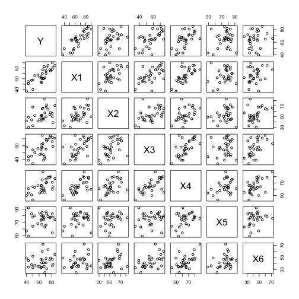
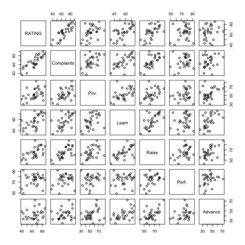
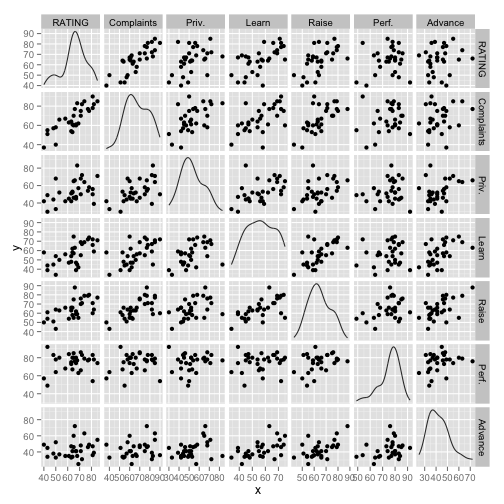
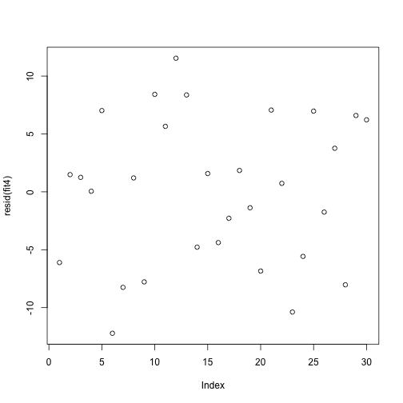
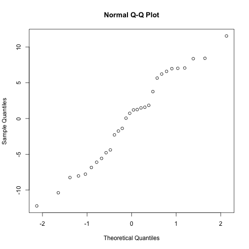
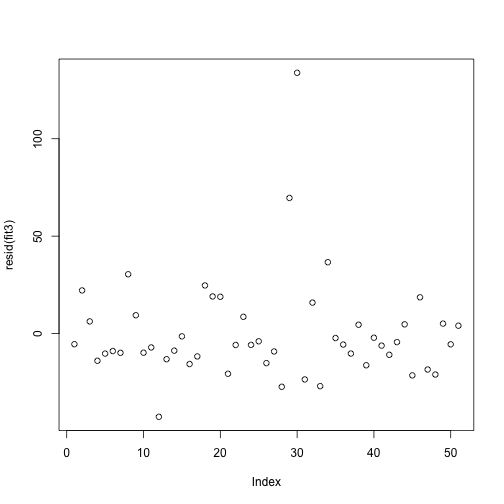
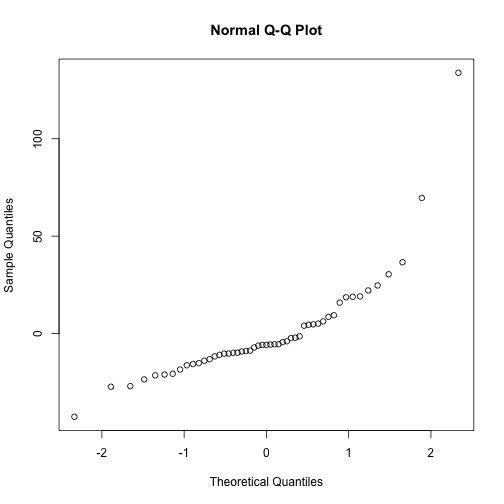

Regression Example: A Better Boss (by Learning from Data)
===============================================================
We're going to learn about being a better boss by learning from a survey.
Question: What makes a better boss? 
Data: 30 Surveys with six scoresets
Output: Quantitative, continuous.
Technique: Multiple regression

## Aside: About R-Markdown
Coding using R-Markdown allows us to 
1. Write our code in a very readable way and
2. Post our code directly to the web, graphics and all, with boostrap or whatever formatting you want.

## About the dataset:
From the machine learning standpoint, we are trying to predict a supervisors score, based on the scores he receives in the six areas below.


__Variable Description:__


_Data set is from "Regression Analysis by Example"_


```r
x <- read.table("http://www.ats.ucla.edu/stat/examples/chp/p054.txt", sep = "\t", 
    h = T)
```


Take a look at the data file: 

```r
head(x)
```

```
##    Y X1 X2 X3 X4 X5 X6
## 1 43 51 30 39 61 92 45
## 2 63 64 51 54 63 73 47
## 3 71 70 68 69 76 86 48
## 4 61 63 45 47 54 84 35
## 5 81 78 56 66 71 83 47
## 6 43 55 49 44 54 49 34
```


Scores across 30 departments are the proportion of variable responses in each category.


## Creating a Model
* The dependent value, the value we are looking to predict, is the supervisor's score which is, as we can see, a continuous variable.


We'll assume a linear model

Where Y is the a linear function of X's and the Error is the discrepency.  We assume that the error is random.


## Drawing a Scatterplot
Let's take scatterplot of each variable pair:


```r
plot(x)
```

 


Hm... its a bit confusing to see what it means. Let's go ahead change the varaible names to be a bit more meaningful:

```r
colnames(x) <- c("RATING", "Complaints", "Priv.", "Learn", "Raise", "Perf.", 
    "Advance")

plot(x)
```

 

And let's jazz it up a little:


```r
library(ggplot2)
plotmatrix(x)  #Part of ggplot. Hadley Wickham is an R god
```

 


<!--
As an aside, ggpairs is very slow, but we can see an output here:

-->
## What can we learn from the scatterplot alone?  
* __Correlations__: it looks like complaints and learning are probably correlated to the RATING.
   * We can see that both complaints and learning increase as ratings increase
   * Note that correlation just tells the relationship between two variables, where-as regression actually provides a predicted value for a response given a predictor variable
* __Histograms__: Our fancy graph gives us a bit more information, with nice histograms for each value.  
   * Our Supervisers have a little suck-pile over on the left there, and otherwise receive slightly above average.
   * Supervisers tended to do pretty well on raises for performance, but not good at pushing employees to advance to new jobs
   * Wide range of opinions on learning opportunities

## Aside: Anscombe's Quartet -- Why plots, and not just numbers, are important:


* Same summary statistics, but totally different datasets.


This linear fit represents the "full model"; eg, the fit with all of the independent variables included

```r
fit <- lm(RATING ~ ., data = x)
summary(fit)
```

```
## 
## Call:
## lm(formula = RATING ~ ., data = x)
## 
## Residuals:
##     Min      1Q  Median      3Q     Max 
## -10.942  -4.356   0.316   5.543  11.599 
## 
## Coefficients:
##             Estimate Std. Error t value Pr(>|t|)    
## (Intercept)  10.7871    11.5893    0.93   0.3616    
## Complaints    0.6132     0.1610    3.81   0.0009 ***
## Priv.        -0.0731     0.1357   -0.54   0.5956    
## Learn         0.3203     0.1685    1.90   0.0699 .  
## Raise         0.0817     0.2215    0.37   0.7155    
## Perf.         0.0384     0.1470    0.26   0.7963    
## Advance      -0.2171     0.1782   -1.22   0.2356    
## ---
## Signif. codes:  0 '***' 0.001 '**' 0.01 '*' 0.05 '.' 0.1 ' ' 1
## 
## Residual standard error: 7.07 on 23 degrees of freedom
## Multiple R-squared:  0.733,	Adjusted R-squared:  0.663 
## F-statistic: 10.5 on 6 and 23 DF,  p-value: 1.24e-05
```

```r
# Just as we suspected from looking Complaints and Learning are
# significantly correlated.
```

## Interpreting the results
* Y Intercept: Score when predictors are zero
* Estimates: Slope -- how much increase in Score based on unit change in Complaints, etc.
* Std. Error: How far off, on average, are the real values from our slope?
* T Value: Usefulnes of predictor: Estimate / Error -- 
* P Value: What are the odds of getting a T value that high from a random population of predictors?  
   * Note that this is a 'test', in that we're testing whether we can say that there is no relationhip (Null Hypothesis).
   * Note that the t-value of zero is "no relationship", or a Beta-Coefficient of zero,
   
   
### Background on p-value and t-values   


__Cool tool to play with this stuff: http://www.stat.berkeley.edu/~stark/Java/Html/tHiLite.htm__

## Interpretation Continued
* Significance codes: technically we would pre-determine what's important here depending on our aims, we might have chosen ".1" as the threshold since, as machine learners, we're just looking to do some predictions and not identify causality or underlying truth
* Residual SE: Average error
* Multiple R-Squared: "Goodness of Fit" ~ Proportion of total variability of Scores explained by predictors.
  * __always__ increases with additions of predictor variables
* Adjusted R-Squared:
  * Increases only if additional variables add more than the automatic amount to predictive power.
  * If we add variables in order of t value, then R Square will peak at point where we have the best fit with the minimum number of terms.  
* F-Statistic: Predictive power of all explanatory variables -- Ratio of explained to unexplained variances.    P-value is compared with no predictive power.  Unlike R-Squared, doesn't indicate % explained.

We can use Adjusted R-Squared now, and manually remove variables to find its peak:


```r
fit2 <- update(fit, . ~ . - Perf.)  # remove feature w/ lowest (abs) t score
summary(fit2)  # note R-sq decreases slightly, but adj R-sq increases slightly
```

```
## 
## Call:
## lm(formula = RATING ~ Complaints + Priv. + Learn + Raise + Advance, 
##     data = x)
## 
## Residuals:
##    Min     1Q Median     3Q    Max 
## -11.81  -4.83   0.42   5.58  11.53 
## 
## Coefficients:
##             Estimate Std. Error t value Pr(>|t|)    
## (Intercept)  12.7979     8.4906    1.51   0.1448    
## Complaints    0.6131     0.1578    3.88   0.0007 ***
## Priv.        -0.0722     0.1330   -0.54   0.5921    
## Learn         0.3117     0.1620    1.92   0.0663 .  
## Raise         0.0980     0.2084    0.47   0.6426    
## Advance      -0.2111     0.1733   -1.22   0.2350    
## ---
## Signif. codes:  0 '***' 0.001 '**' 0.01 '*' 0.05 '.' 0.1 ' ' 1
## 
## Residual standard error: 6.93 on 24 degrees of freedom
## Multiple R-squared:  0.732,	Adjusted R-squared:  0.676 
## F-statistic: 13.1 on 5 and 24 DF,  p-value: 3.28e-06
```

```r
# --> increasing bias, decreasing variance

fit3 <- update(fit2, . ~ . - Raise)  # ditto
summary(fit3)
```

```
## 
## Call:
## lm(formula = RATING ~ Complaints + Priv. + Learn + Advance, data = x)
## 
## Residuals:
##     Min      1Q  Median      3Q     Max 
## -11.898  -5.517   0.765   5.809  11.502 
## 
## Coefficients:
##             Estimate Std. Error t value Pr(>|t|)    
## (Intercept)  14.3035     7.7396    1.85    0.076 .  
## Complaints    0.6534     0.1305    5.01  3.7e-05 ***
## Priv.        -0.0768     0.1306   -0.59    0.562    
## Learn         0.3239     0.1574    2.06    0.050 .  
## Advance      -0.1715     0.1490   -1.15    0.261    
## ---
## Signif. codes:  0 '***' 0.001 '**' 0.01 '*' 0.05 '.' 0.1 ' ' 1
## 
## Residual standard error: 6.82 on 25 degrees of freedom
## Multiple R-squared:  0.729,	Adjusted R-squared:  0.686 
## F-statistic: 16.8 on 4 and 25 DF,  p-value: 8.13e-07
```

```r

fit4 <- update(fit3, . ~ . - Priv.)  # ditto
summary(fit4)  # stopping criteria met: all featuers have |t| > 1a
```

```
## 
## Call:
## lm(formula = RATING ~ Complaints + Learn + Advance, data = x)
## 
## Residuals:
##     Min      1Q  Median      3Q     Max 
## -12.217  -5.377   0.967   6.078  11.540 
## 
## Coefficients:
##             Estimate Std. Error t value Pr(>|t|)    
## (Intercept)   13.578      7.544    1.80    0.084 .  
## Complaints     0.623      0.118    5.27  1.6e-05 ***
## Learn          0.312      0.154    2.03    0.053 .  
## Advance       -0.187      0.145   -1.29    0.208    
## ---
## Signif. codes:  0 '***' 0.001 '**' 0.01 '*' 0.05 '.' 0.1 ' ' 1
## 
## Residual standard error: 6.73 on 26 degrees of freedom
## Multiple R-squared:  0.726,	Adjusted R-squared:  0.694 
## F-statistic: 22.9 on 3 and 26 DF,  p-value: 1.81e-07
```

```r
# --> optimal bias-variance pt reached --> Residual standard error (RSE)
# minimized

fit5 <- update(fit4, . ~ . - Advance)  # note this model is weaker (lower R-sq, higher RSE)
summary(fit5)
```

```
## 
## Call:
## lm(formula = RATING ~ Complaints + Learn, data = x)
## 
## Residuals:
##    Min     1Q Median     3Q    Max 
## -11.56  -5.73   0.67   6.53  10.36 
## 
## Coefficients:
##             Estimate Std. Error t value Pr(>|t|)    
## (Intercept)    9.871      7.061    1.40     0.17    
## Complaints     0.644      0.118    5.43  9.6e-06 ***
## Learn          0.211      0.134    1.57     0.13    
## ---
## Signif. codes:  0 '***' 0.001 '**' 0.01 '*' 0.05 '.' 0.1 ' ' 1
## 
## Residual standard error: 6.82 on 27 degrees of freedom
## Multiple R-squared:  0.708,	Adjusted R-squared:  0.686 
## F-statistic: 32.7 on 2 and 27 DF,  p-value: 6.06e-08
```

```r

fit6 <- update(fit5, . ~ . - X3)  # weaker still
summary(fit6)
```

```
## 
## Call:
## lm(formula = RATING ~ Complaints + Learn, data = x)
## 
## Residuals:
##    Min     1Q Median     3Q    Max 
## -11.56  -5.73   0.67   6.53  10.36 
## 
## Coefficients:
##             Estimate Std. Error t value Pr(>|t|)    
## (Intercept)    9.871      7.061    1.40     0.17    
## Complaints     0.644      0.118    5.43  9.6e-06 ***
## Learn          0.211      0.134    1.57     0.13    
## ---
## Signif. codes:  0 '***' 0.001 '**' 0.01 '*' 0.05 '.' 0.1 ' ' 1
## 
## Residual standard error: 6.82 on 27 degrees of freedom
## Multiple R-squared:  0.708,	Adjusted R-squared:  0.686 
## F-statistic: 32.7 on 2 and 27 DF,  p-value: 6.06e-08
```

```r

plot(resid(fit4))  # want to see absence of structure in resid scatterplot ('gaussian white noise')
```

 

```r
# --> this plot looks pretty good; also note that resid quartiles look good

qqnorm(resid(fit4))  # want to see straight diagonal line in resid qqplot
```

 

```r
# --> again, looks pretty good
```


## EXAMPLE 2 - cigarette consumptio

```r
x <- read.table("http://www.ats.ucla.edu/stat/examples/chp/p081.txt", sep = "\t", 
    h = T)
head(x)
```

```
##   State  Age   HS Income Black Female Price Sales
## 1    AL 27.0 41.3   2948  26.2   51.7  42.7  89.8
## 2    AK 22.9 66.7   4644   3.0   45.7  41.8 121.3
## 3    AZ 26.3 58.1   3665   3.0   50.8  38.5 115.2
## 4    AR 29.1 39.9   2878  18.3   51.5  38.8 100.3
## 5    CA 28.1 62.6   4493   7.0   50.8  39.7 123.0
## 6    CO 26.2 63.9   3855   3.0   50.7  31.1 124.8
```

```r
x$State <- NULL  # remove state label

fit <- lm(Sales ~ ., data = x)  # full model
summary(fit)
```

```
## 
## Call:
## lm(formula = Sales ~ ., data = x)
## 
## Residuals:
##    Min     1Q Median     3Q    Max 
## -48.40 -12.39  -5.37   6.27 133.21 
## 
## Coefficients:
##             Estimate Std. Error t value Pr(>|t|)   
## (Intercept) 103.3448   245.6072    0.42   0.6760   
## Age           4.5205     3.2198    1.40   0.1673   
## HS           -0.0616     0.8147   -0.08   0.9401   
## Income        0.0189     0.0102    1.85   0.0704 . 
## Black         0.3575     0.4872    0.73   0.4669   
## Female       -1.0529     5.5610   -0.19   0.8507   
## Price        -3.2549     1.0314   -3.16   0.0029 **
## ---
## Signif. codes:  0 '***' 0.001 '**' 0.01 '*' 0.05 '.' 0.1 ' ' 1
## 
## Residual standard error: 28.2 on 44 degrees of freedom
## Multiple R-squared:  0.321,	Adjusted R-squared:  0.228 
## F-statistic: 3.46 on 6 and 44 DF,  p-value: 0.00686
```

```r

fit <- lm(Sales ~ 0 + ., data = x)  # remove intercept
summary(fit)  # note weird stats! (high R-sq, low t-scores)
```

```
## 
## Call:
## lm(formula = Sales ~ 0 + ., data = x)
## 
## Residuals:
##    Min     1Q Median     3Q    Max 
## -44.82 -11.13  -6.13   5.33 132.54 
## 
## Coefficients:
##        Estimate Std. Error t value Pr(>|t|)   
## Age     3.93883    2.88125    1.37   0.1784   
## HS     -0.00229    0.79503    0.00   0.9977   
## Income  0.01950    0.01004    1.94   0.0583 . 
## Black   0.28944    0.45534    0.64   0.5282   
## Female  1.15527    1.82304    0.63   0.5295   
## Price  -3.19659    1.01266   -3.16   0.0028 **
## ---
## Signif. codes:  0 '***' 0.001 '**' 0.01 '*' 0.05 '.' 0.1 ' ' 1
## 
## Residual standard error: 27.9 on 45 degrees of freedom
## Multiple R-squared:  0.956,	Adjusted R-squared:  0.951 
## F-statistic:  165 on 6 and 45 DF,  p-value: <2e-16
```

```r
# --> linear regression assumps violated --> likely explanation: need more
# data for prediction
fit2 <- update(fit, . ~ . - HS)
summary(fit2)
```

```
## 
## Call:
## lm(formula = Sales ~ Age + Income + Black + Female + Price - 
##     1, data = x)
## 
## Residuals:
##    Min     1Q Median     3Q    Max 
## -44.81 -11.13  -6.12   5.34 132.54 
## 
## Coefficients:
##        Estimate Std. Error t value Pr(>|t|)   
## Age     3.94234    2.58306    1.53   0.1338   
## Income  0.01948    0.00686    2.84   0.0067 **
## Black   0.29035    0.32572    0.89   0.3773   
## Female  1.15210    1.43573    0.80   0.4264   
## Price  -3.19624    0.99413   -3.22   0.0024 **
## ---
## Signif. codes:  0 '***' 0.001 '**' 0.01 '*' 0.05 '.' 0.1 ' ' 1
## 
## Residual standard error: 27.6 on 46 degrees of freedom
## Multiple R-squared:  0.956,	Adjusted R-squared:  0.952 
## F-statistic:  202 on 5 and 46 DF,  p-value: <2e-16
```

```r

fit3 <- update(fit2, . ~ . - Female)
summary(fit3)  # note t-score of Age jumps (Age becomes much more significant)
```

```
## 
## Call:
## lm(formula = Sales ~ Age + Income + Black + Price - 1, data = x)
## 
## Residuals:
##    Min     1Q Median     3Q    Max 
## -42.71 -12.43  -5.81   5.68 133.84 
## 
## Coefficients:
##        Estimate Std. Error t value Pr(>|t|)    
## Age     5.66372    1.43345    3.95  0.00026 ***
## Income  0.01952    0.00683    2.86  0.00634 ** 
## Black   0.37111    0.30860    1.20  0.23517    
## Price  -2.92582    0.93173   -3.14  0.00292 ** 
## ---
## Signif. codes:  0 '***' 0.001 '**' 0.01 '*' 0.05 '.' 0.1 ' ' 1
## 
## Residual standard error: 27.5 on 47 degrees of freedom
## Multiple R-squared:  0.956,	Adjusted R-squared:  0.952 
## F-statistic:  254 on 4 and 47 DF,  p-value: <2e-16
```

```r
# --> make sure you remove only one feature at a time with BE!

plot(resid(fit3))  # obvious outlier present
```

 

```r
qqnorm(resid(fit3))  # this does not look good! also resid quartiles are out of wack
```

 

```r
# --> conclusion: this dataset doesn't support multiple linear regression
# very well!  --> next step: before discarding modeling approach, get more
# data!
```


